# IF3250_K03_G06_STEI1-BE
# Sistem Terintegrasi Repository dan Dashboard Data Akreditasi

## Dokumentasi Proyek

### Tim Pengembang
- **Muhamad Nazih Najmudin** (13523144)
- **Andri Nurdianto** (13523145)
- **Ardell Aghna Mahendra** (13523151)
- **Hasri Fayadh Muqaffa** (13523156)
- **I Made Wiweka Putera** (13523160)

**Program Studi Teknik Informatika**  
**Institut Teknologi Bandung**

---

## Daftar Isi

1. [Tentang Proyek](#tentang-proyek)
2. [Arsitektur Sistem](#arsitektur-sistem)
3. [Teknologi yang Digunakan](#teknologi-yang-digunakan)
4. [Repositori](#repositori)
5. [Cara Instalasi](#cara-instalasi)
6. [Alur Kerja Pengembangan (Scrum)](#alur-kerja-pengembangan-scrum)
7. [Fitur dan Panduan Penggunaan](#fitur-dan-panduan-penggunaan)
8. [Tim Pengembang](#tim-pengembang)

---

## Tentang Proyek

### Latar Belakang

Sistem Terintegrasi Repository dan Dashboard Data Akreditasi adalah platform berbasis web yang dikembangkan untuk memfasilitasi proses persiapan akreditasi di Sekolah Teknik Elektro dan Informatika (STEI) Institut Teknologi Bandung. Sistem ini mengelola 11 program studi dengan menyediakan fitur pengisian dokumen, pemantauan progres, simulasi skor, dan notifikasi peringatan dini.

### Tujuan

1. Menyediakan platform bagi Dekanat/Bukabag untuk memantau progres akreditasi 11 program studi secara *real-time*
2. Memfasilitasi tim prodi dalam mengelola dokumen LKPS (format Excel) dan LED (format Word)
3. Menyediakan fitur *early warning* melalui notifikasi peringatan
4. Melakukan simulasi skor akreditasi berdasarkan matriks penilaian lembaga
5. Menjadi pusat data akreditasi terpusat yang terkoordinasi secara sistematis

### Pemilik Perangkat Lunak

- **Mohammad Mukhlis** - Super Admin ITB
- **Koko Panji Komara** - Product Owner dari SPSI STEI ITB

---

## Arsitektur Sistem

### Deskripsi Arsitektur

Sistem dibangun menggunakan arsitektur berbasis web (*Web-based Architecture*) dengan model *client-server*:

- **Client**: Antarmuka pengguna (*frontend*) yang diakses melalui peramban
- **Server**: Inti logika bisnis aplikasi (*backend*)
- **Database**: Pusat penyimpanan data menggunakan PostgreSQL

### Diagram Arsitektur

#### Use Case Diagram

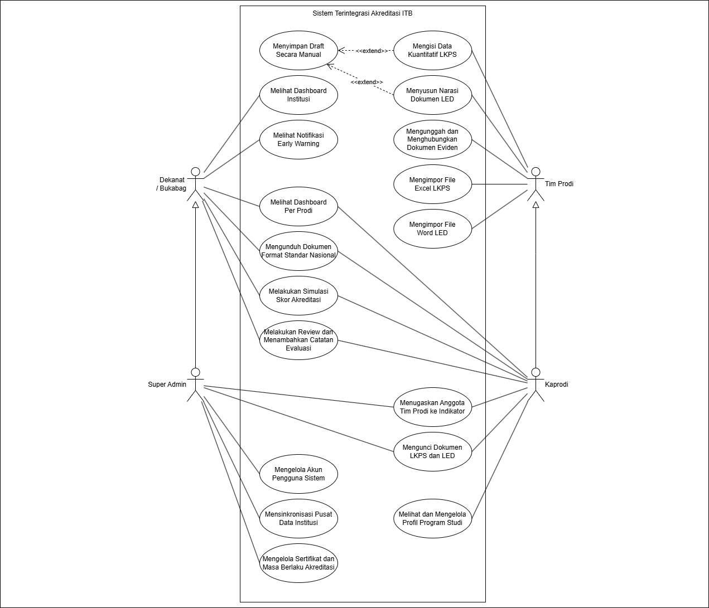

#### Diagram Deployment

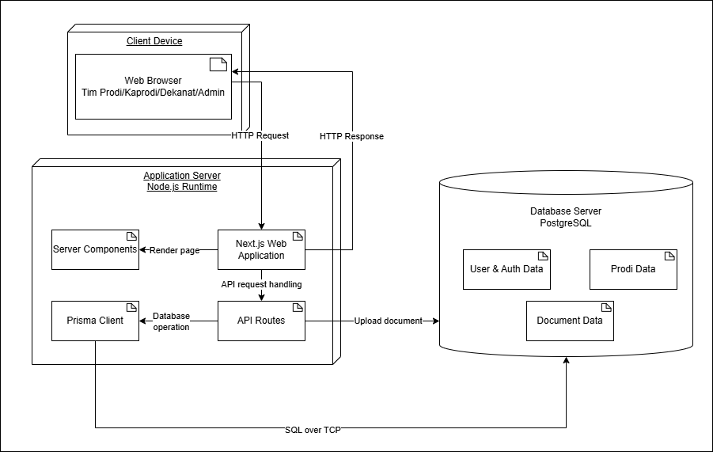

#### Diagram Komponen

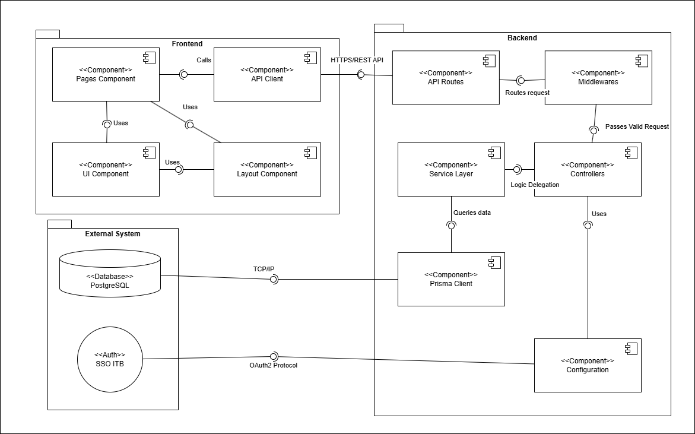

#### Diagram Kelas Frontend

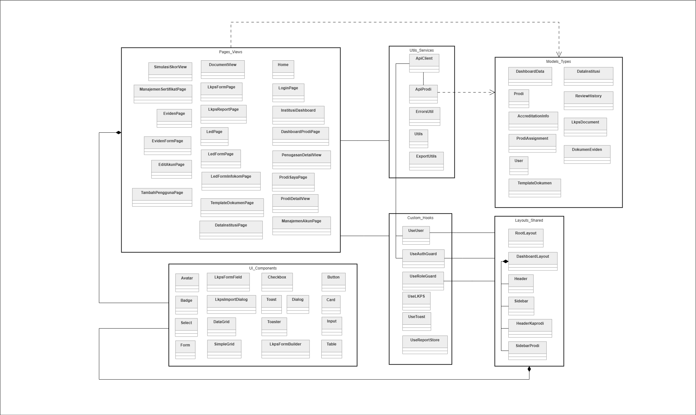

#### Diagram Kelas Backend

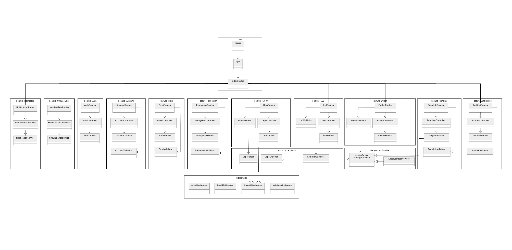

---

## Teknologi yang Digunakan

### Backend
- **Runtime**: Node.js v20.x
- **Framework**: Express.js
- **ORM**: Prisma
- **Database**: PostgreSQL
- **Bahasa**: TypeScript
- **Autentikasi**: JWT, Passport.js (SSO ITB)
- **Pengujian**: Jest, Supertest

### Frontend
- **Framework**: Next.js (React)
- **Bahasa**: TypeScript
- **Styling**: TailwindCSS
- **State Management**: React Hooks, Zustand
- **UI Components**: Shadcn/ui

### Deployment
- **Hosting**: Vercel
- **Database**: Supabase (PostgreSQL)
- **Containerization**: Docker, Docker Compose
- **CI/CD**: GitLab CI, GitHub Mirror

---

## Repositori

### Backend Repository
- **URL**: https://github.com/kelompok6-ppl/akreditasi-be
- **Stack**: Express.js + TypeScript + Prisma + PostgreSQL

### Frontend Repository
- **URL**: https://github.com/kelompok6-ppl/akreditasi-fe
- **Stack**: Next.js + TypeScript + TailwindCSS

---

## Cara Instalasi

### Persyaratan Sistem

**Perangkat Keras:**
- Prosesor: Dual-Core 2.0 GHz atau lebih tinggi
- RAM: Minimal 4 GB (rekomendasi: 8 GB)
- Ruang Penyimpanan: Minimal 2 GB

**Perangkat Lunak:**
- Node.js v20.x atau lebih baru
- PostgreSQL v14 atau lebih baru
- Docker & Docker Compose (opsional)

### Metode 1: Instalasi Lokal (Manual Setup)

#### Backend

```bash
# 1. Clone repository
git clone https://github.com/kelompok6-ppl/akreditasi-be
cd akreditasi-be

# 2. Install dependencies
npm ci

# 3. Setup environment variables
cp .env.example .env
# Edit .env dengan konfigurasi database

# 4. Generate Prisma Client dan migrate database
npx prisma generate
npx prisma migrate dev

# 5. Seed database dengan data dummy
npm run db:seed

# 6. Jalankan server
npm run dev
```

#### Frontend

```bash
# 1. Clone repository
git clone https://github.com/kelompok6-ppl/akreditasi-fe
cd akreditasi-fe

# 2. Install dependencies
npm install

# 3. Setup environment variables
cp .env.example .env
# Edit .env dengan API_URL

# 4. Jalankan server
npm run dev
```

### Metode 2: Instalasi via Docker Compose

```bash
# Backend
cd akreditasi-be
docker compose up --build -d

# Frontend (terminal terpisah)
cd akreditasi-fe
docker compose up --build -d
```

### Verifikasi
- Frontend: http://localhost:3000
- Backend API: http://localhost:8000

**Akun Demo:**
- Super Admin: dummyadmin@email.com / password123
- Pimpinan: dummypimpinan@email.com / password123
- Kaprodi IF: kaprodi.if@email.com / password123
- Tim Prodi: tim.prodi@email.com / password123

---

## Alur Kerja Pengembangan (Scrum)

Proyek ini dikembangkan menggunakan metodologi Scrum dengan 5 sprint selama periode pengembangan.

### Sprint 1: Fondasi Teknis dan Autentikasi

**Sprint Goal:**
1. Membangun fondasi teknis proyek (repository, environment, design system, CI/CD)
2. Implementasi sistem autentikasi berbasis role dan SSO ITB
3. Membangun halaman manajemen akun
4. Membangun kerangka dashboard institusi

**Deliverables:**
- Repository frontend dan backend dengan struktur proyek
- CI/CD pipeline dengan GitLab CI
- Halaman login dengan autentikasi JWT
- Halaman manajemen akun untuk Super Admin
- Kerangka dashboard institusi

### Sprint 2: Dashboard Prodi dan Penugasan

**Sprint Goal:**
1. Revisi dari pengerjaan sprint 1
2. Implementasi perubahan role sistem (5 role menjadi 4 role)
3. Membangun kerangka dashboard prodi dan profil prodi
4. Implementasi fitur penugasan anggota Tim Prodi
5. Membangun fitur Impor dan Ekspor LKPS dan LED

**Deliverables:**
- Dashboard per program studi
- Profil program studi dengan CRUD
- Fitur penugasan PIC ke indikator/kriteria
- Impor dan ekspor dokumen LKPS (Excel)
- Impor dan ekspor dokumen LED (Word)

### Sprint 3: Formulir Pengisian dan Manajemen Eviden

**Sprint Goal:**
1. Revisi sprint 2 (FE fetch real data ke BE)
2. Membangun formulir pengisian data LKPS per prodi (spreadsheet digital)
3. Membangun formulir pengisian narasi LED (rich text editor)
4. Implementasi penyimpanan draft otomatis dan manual
5. Membangun fitur manajemen unggahan dokumen evidence
6. Membangun repository dokumen contoh dan template

**Deliverables:**
- Formulir LKPS dengan spreadsheet digital
- Formulir LED dengan rich text editor
- Auto-save dan manual save untuk LKPS dan LED
- Manajemen unggahan evidence dengan tagging indikator
- Repository template untuk Super Admin

### Sprint 4: Simulasi, Notifikasi, dan Penguncian

**Sprint Goal:**
1. Revisi sprint 3
2. Membuat fitur simulasi skor akreditasi
3. Membuat mekanisme penguncian data (draft/final)
4. Membuat sinkronisasi pusat data institusi
5. Membuat Early Warning dan Notification System
6. Membuat manajemen sertifikat dan masa berlaku akreditasi

**Deliverables:**
- Simulasi skor akreditasi
- Mekanisme lock/unlock dokumen
- Sinkronisasi data institusi ke seluruh prodi
- Notifikasi early warning
- Manajemen sertifikat akreditasi

### Sprint 5: Perbaikan dan Deployment

**Sprint Goal:**
1. Melakukan perbaikan bug dari seluruh sprint
2. Penyesuaian konsistensi visual (sidebar, page, toast)
3. Menyiapkan lingkungan deployment
4. Pengetesan akhir fungsionalitas aplikasi

**Deliverables:**
- Aplikasi siap production
- Dokumentasi teknis lengkap
- Panduan penggunaan pengguna
- Final testing dan bug fixing

---

## Fitur dan Panduan Penggunaan

### Kelompok Fitur 1: Administrasi Sistem & Data Pusat

#### A. Mengelola Akun Pengguna Sistem
**Aktor**: Super Admin

| Langkah | Aksi | Hasil |
|---------|------|-------|
| 1 | Pilih menu "Manajemen Akun" | Menampilkan daftar pengguna |
| 2 | Klik "Tambah Pengguna" | Menampilkan form pengguna baru |
| 3 | Isi Nama, Email, Peran, Program Studi | Data tervalidasi |
| 4 | Klik "Simpan" | Akun terbuat dan pengguna mendapat email |

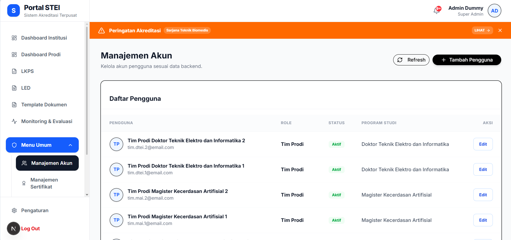

#### B. Sinkronisasi Pusat Data Institusi
**Aktor**: Super Admin

| Langkah | Aksi | Hasil |
|---------|------|-------|
| 1 | Pilih menu "Pusat Data Institusi" | Menampilkan spreadsheet institusi |
| 2 | Pilih sheet LKPS | Menampilkan tabel data |
| 3 | Isi data kuantitatif fakultas | Data tersimpan |
| 4 | Klik "Simpan & Sinkronisasi" | Data tersinkronisasi ke 11 prodi |

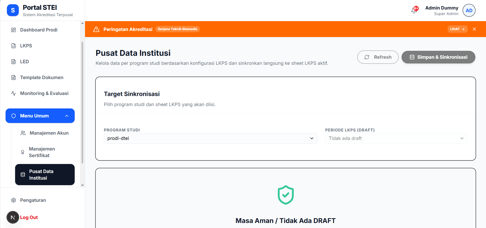

#### C. Mengelola Sertifikat & Masa Berlaku Akreditasi
**Aktor**: Super Admin

| Langkah | Aksi | Hasil |
|---------|------|-------|
| 1 | Pilih menu "Manajemen Sertifikat" | Menampilkan tabel sertifikat |
| 2 | Klik "Edit" pada prodi target | Menampilkan modal edit |
| 3 | Isi grade, tanggal mulai, tanggal akhir | Data tervalidasi |
| 4 | Upload file sertifikat | File tersimpan |
| 5 | Klik "Simpan" | Data akreditasi terupdate |

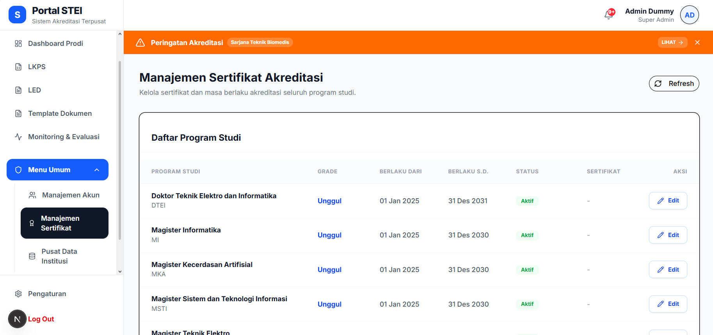

---

### Kelompok Fitur 2: Manajemen Internal Program Studi

#### A. Pembagian Tugas & Penugasan PIC Kriteria
**Aktor**: Kaprodi

| Langkah | Aksi | Hasil |
|---------|------|-------|
| 1 | Pilih menu "Penugasan Tim Prodi" | Menampilkan daftar kriteria |
| 2 | Klik kolom "Pilih PIC" | Menampilkan dropdown anggota |
| 3 | Pilih nama anggota tim | PIC terpilih |
| 4 | Klik "Tugaskan" | Tugas terdelegasi ke PIC |

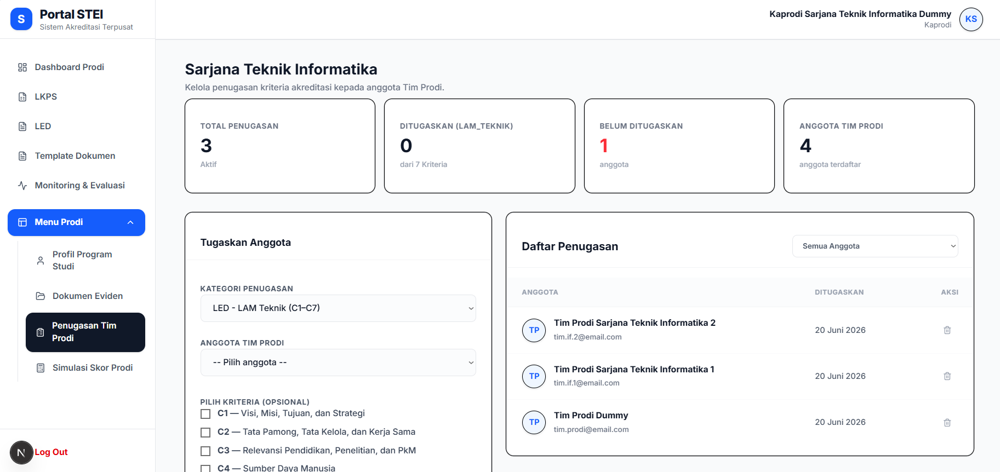

#### B. Mengelola Profil Program Studi
**Aktor**: Kaprodi

| Langkah | Aksi | Hasil |
|---------|------|-------|
| 1 | Pilih menu "Profil Program Studi" | Menampilkan profil prodi |
| 2 | Klik "Edit Profil" | Form edit terbuka |
| 3 | Ubah data (visi, misi, dll.) | Data terupdate |
| 4 | Klik "Simpan" | Perubahan tersimpan |

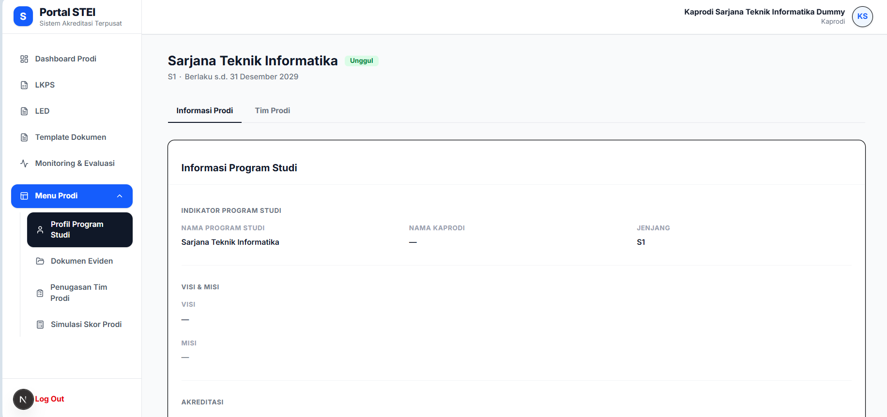

---

### Kelompok Fitur 3: Pengisian Dokumen & Pengelolaan Eviden

#### A. Pengisian Data Kuantitatif LKPS
**Aktor**: Tim Prodi, Kaprodi

| Langkah | Aksi | Hasil |
|---------|------|-------|
| 1 | Pilih menu "LKPS" | Menampilkan daftar kriteria |
| 2 | Pilih kriteria dan tabel | Spreadsheet digital terbuka |
| 3 | Isi data pada sel | Auto-save secara berkala |
| 4 | Klik "Simpan Draft" | Data tersimpan manual |

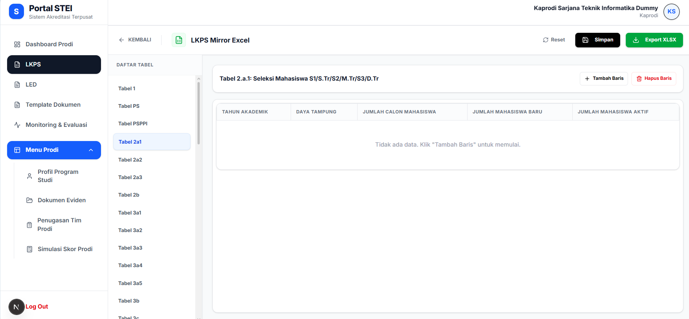

#### B. Menyusun Narasi Dokumen LED
**Aktor**: Tim Prodi, Kaprodi

| Langkah | Aksi | Hasil |
|---------|------|-------|
| 1 | Pilih menu "LED" | Menampilkan daftar kriteria |
| 2 | Pilih bab kriteria | Rich text editor terbuka |
| 3 | Tulis narasi dengan format teks | Konten terformat |
| 4 | Klik "Simpan Laporan" | Draft LED tersimpan |

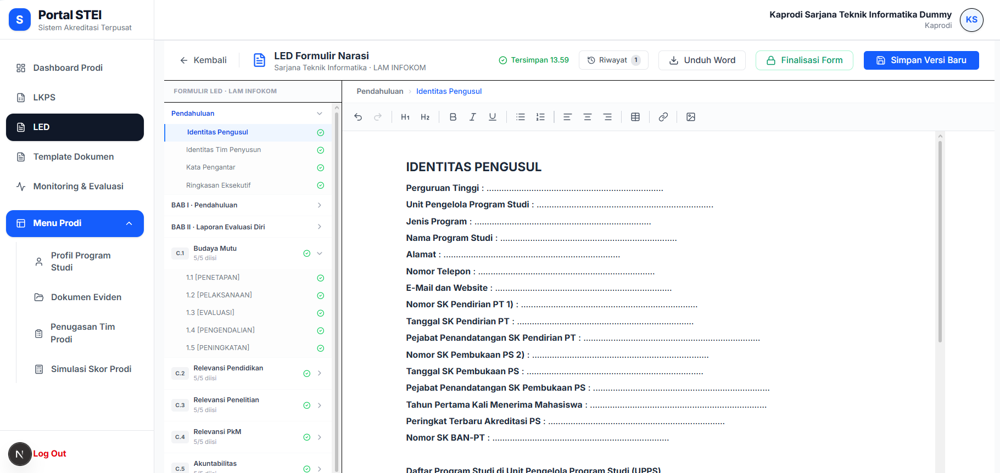

#### C. Mengimpor Dokumen LKPS (Excel) & LED (Word)
**Aktor**: Tim Prodi, Kaprodi

| Langkah | Aksi | Hasil |
|---------|------|-------|
| **LKPS** | | |
| 1 | Buka halaman LKPS | Daftar LKPS tampil |
| 2 | Klik "Impor Excel" | Dialog upload terbuka |
| 3 | Pilih file Excel | Preview data tampil |
| 4 | Klik "Unggah & Proses" | Data terparse ke sistem |
| **LED** | | |
| 1 | Buka halaman LED | Daftar LED tampil |
| 2 | Klik "Impor Word (DOCX)" | Dialog upload terbuka |
| 3 | Pilih file Word | File terupload sebagai arsip |

#### D. Mengunggah & Menghubungkan Dokumen Eviden
**Aktor**: Tim Prodi, Kaprodi

| Langkah | Aksi | Hasil |
|---------|------|-------|
| 1 | Pilih menu "Dokumen Eviden" | Daftar eviden tampil |
| 2 | Klik "Tambah Eviden" | Form eviden terbuka |
| 3 | Isi judul, deskripsi, periode | Data tervalidasi |
| 4 | Upload file bukti | File tersimpan |
| 5 | Centang indikator relevan | Eviden ter-tag ke indikator |
| 6 | Klik "Simpan & Tautkan" | Eviden tersimpan |

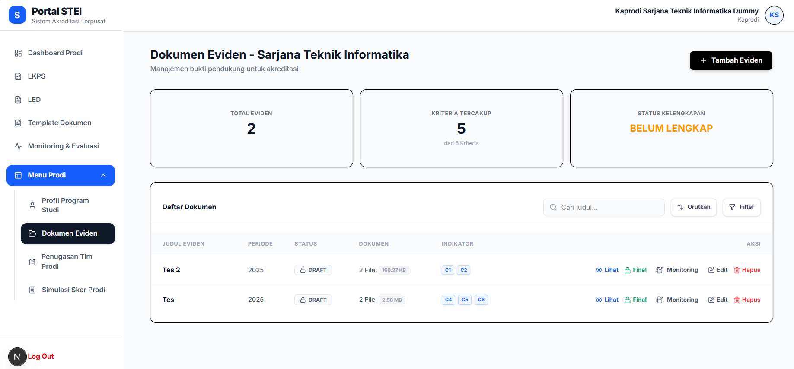

---

### Kelompok Fitur 4: Pemantauan, Simulasi & Evaluasi

#### A. Pemantauan Dashboard (Institusi & Prodi)
**Aktor**: Dekanat/Bukabag, Kaprodi, Super Admin

**Dashboard Institusi:**
- Menampilkan rekapitulasi 11 program studi
- Status kesiapan dokumen (warna: hijau/kuning/merah)
- Persentase progress pengisian
- Grafik simulasi nilai
- Sisa masa berlaku sertifikat

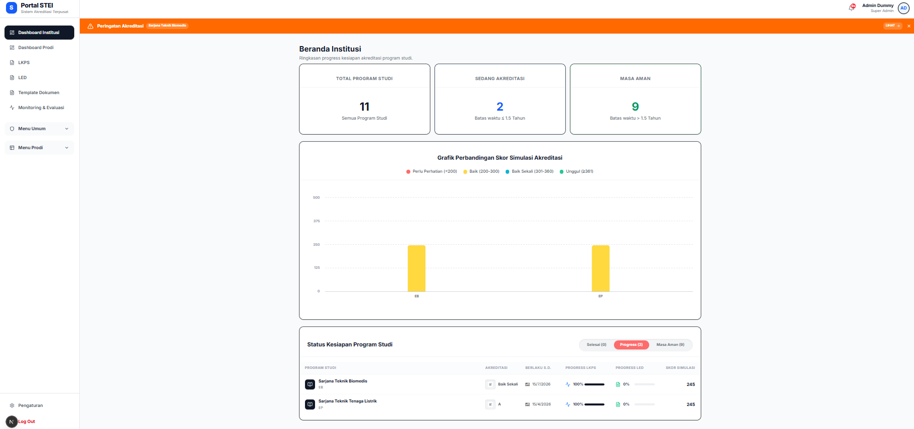

**Dashboard Prodi:**
- Profil program studi detail
- Status kelengkapan LKPS/LED per kriteria
- Peringkat akreditasi saat ini
- Notifikasi tugas aktif

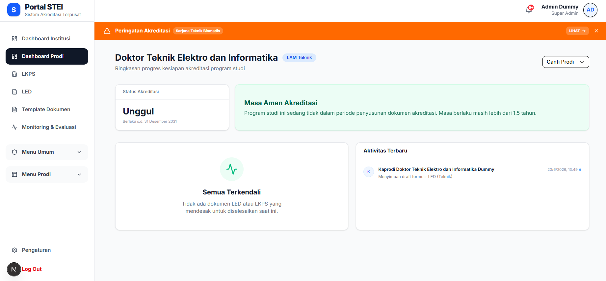

#### B. Simulasi Skor & Notifikasi Peringatan Dini

**Simulasi Skor:**
| Langkah | Aksi | Hasil |
|---------|------|-------|
| 1 | Buka dashboard prodi | Menu tampil |
| 2 | Pilih "Simulasi Skor Prodi" | Perhitungan otomatis |
| 3 | Lihat skor kuantitatif | Estimasi skor tampil |
| 4 | Input nilai kualitatif manual | Prediksi total skor |

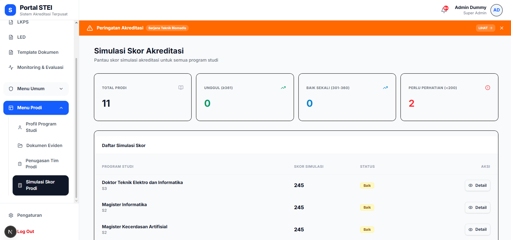

**Notifikasi Peringatan Dini:**
- Badge merah pada ikon lonceng
- Indikator kritis teridentifikasi
- Detail indikator perlu perbaikan

#### C. Catatan Monitoring, Evaluasi, & Umpan Balik
**Aktor**: Dekanat/Bukabag, Kaprodi, Super Admin

| Langkah | Aksi | Hasil |
|---------|------|-------|
| 1 | Pilih menu "Monitoring & Evaluasi" | Daftar dokumen tampil |
| 2 | Klik "Monitoring" | Dialog Monev terbuka |
| 3 | Isi kode indikator, catatan, evaluasi | Catatan tersimpan |
| 4 | Set status (OPEN/IN_PROGRESS/RESOLVED) | Status terupdate |
| 5 | Lihat riwayat evaluasi | Rekam jejak tersedia |

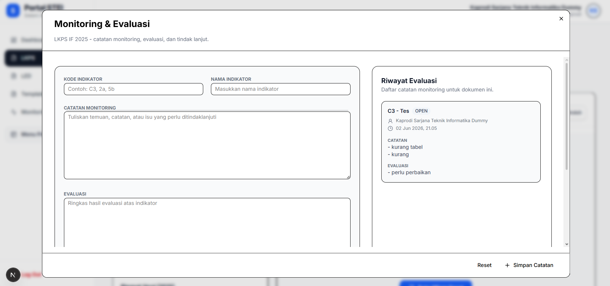

#### D. Finalisasi & Penguncian Dokumen
**Aktor**: Kaprodi

| Langkah | Aksi | Hasil |
|---------|------|-------|
| 1 | Buka dokumen LKPS/LED/Eviden | Konten dokumen tampil |
| 2 | Klik "Finalisasi / Kunci Dokumen" | Status berubah menjadi FINAL |
| 3 | Ikon gembok kuning muncul | Dokumen terkunci |
| 4 | (Opsional) Klik "Buka Kunci" | Status kembali DRAFT |

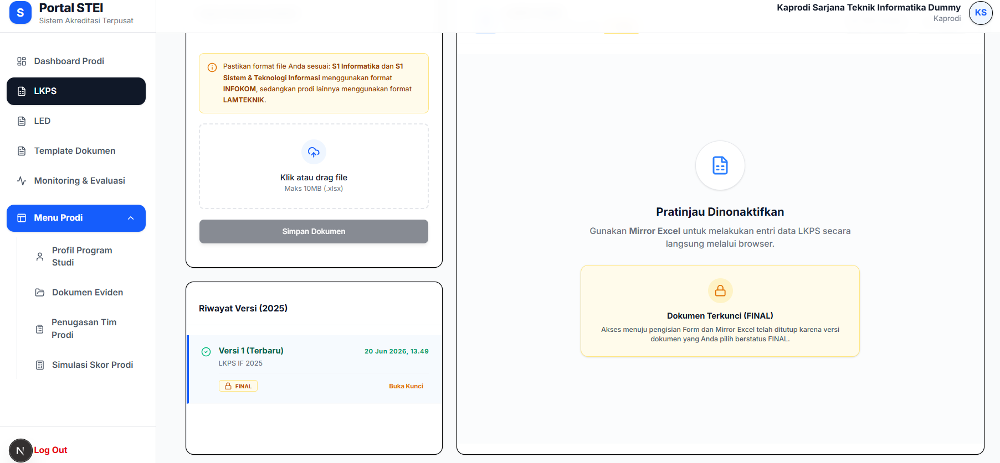

---

## Tim Pengembang

| Nama | NIM | Peran dalam Tim |
|------|-----|-----------------|
| Muhamad Nazih Najmudin | 13523144 | Backend Developer, Database Engineer, Scrum Master Sprint 5 |
| Andri Nurdianto | 13523145 | Backend Developer, API Specialist, Scrum Master Sprint 4 |
| Ardell Aghna Mahendra | 13523151 | Frontend Developer, UI/UX Designer, Scrum Master Sprint 2 |
| Hasri Fayadh Muqaffa | 13523156 | Fullstack Developer, Scrum Master Sprint 1|
| I Made Wiweka Putera | 13523160 | Frontend Developer, Scrum Master Sprint 3 |

---

## Lisensi

Hak cipta dilindungi oleh Program Studi Teknik Informatika ITB dan SPSI STEI ITB.

Dilarang me-reproduksi dokumen ini tanpa diketahui oleh Program Studi Teknik Informatika ITB.